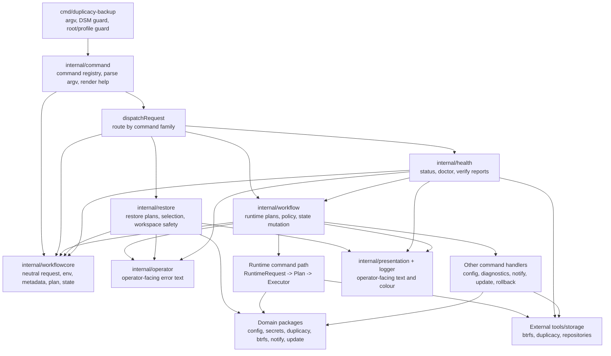

# Architecture

This is the short architecture overview for the project.

If you want the detailed internal walkthrough, including the runtime path,
package boundaries, and where specific responsibilities now live, see
[how-it-works.md](how-it-works.md).

## Overview

The application follows an explicit command-specific request model.

The parser returns a typed command value from the command registry. Each command
then projects its transitional request payload into the narrow input type it
actually needs. Only runtime backup, prune, and cleanup-storage operations
continue into the `RuntimeRequest -> Plan -> Execute` path.

## Top-Level Flow

`cmd/duplicacy-backup/main.go` is now thin wiring only:



```text
runWithArgs
  -> command.ParseRequest
  -> handled help/version output, or typed command dispatch
       -> config / diagnostics / notify / restore / rollback / update / health / runtime
```

Only the runtime backup/prune/cleanup path goes through the full
`Planner.Build -> Executor.Run` sequence. Config, diagnostics, notify,
restore, rollback, update, and health commands dispatch to their own narrower
handlers so they do not inherit runtime requirements such as root access,
logger setup, or target storage secrets unless that command actually needs
them.

## Design Principles

Design simplicity and operational clarity take priority over backwards
compatibility. If a CLI surface, config shape, output format, workflow, or
internal API needs to change to make the model clearer and safer, prefer the
cleaner contract over compatibility shims.

Breaking changes are acceptable when they reduce ambiguity, remove legacy
behaviour, or make the operator model easier to reason about. When a surface
changes, update the help text, docs, smoke tests, release notes, and operator
transition guidance so operators can see the new contract plainly.

## Command Boundaries

`internal/command` owns CLI parsing and help text. Its parser and help files are
split by command family around a shared source/target flag parser, and the
command registry is the source of truth for public command names, parser
coverage, help coverage, DSM policy, and profile/root policy. Dispatch then
routes the typed command by registry family and projects the transitional
request payload into command-specific requests before execution.

The registry is now the single source of truth for public command metadata and
dispatch family. The remaining transitional shape is the request payload inside
each typed command; a later slice can replace that payload with fully
command-specific request structs without rediscovering parser, help, and
privilege policy coverage.

Workflow handlers should work from narrow request types rather than passing the
parser envelope deeper into the system. Every command family now has a narrow
projection; runtime backup, prune, and cleanup-storage are simply the command
family whose narrow projection continues into the full planning path:

```text
RuntimeRequest -> Plan -> Executor
```

The `Plan` stores runtime data in explicit sections for request intent,
resolved config, and derived paths. Planning validates and derives; execution
mutates; presentation helpers render operator-facing command text lazily from
the plan data. That separation is the key runtime boundary.

After typed command routing lands, `internal/workflow` may be renamed to
`internal/runtime` if the remaining package ownership is runtime-specific
enough to justify the churn.

For the detailed request, plan, execute, presentation, and error-translation
walkthrough, use [how-it-works.md](how-it-works.md).

## Restore Subsystem

Restore is a first-class subsystem, not a single workflow file. It lives in
`internal/restore` so restore-specific prompts, workspace safety, reports, and
interactive selection can evolve behind a focused package boundary.

Neutral shared primitives such as `Request`, `Metadata`, `Env`, `Plan`,
`RunState`, and profile state paths now live in `internal/workflowcore`. The
restore package imports those primitives from the core package rather than from
the workflow orchestrator. A deliberately narrow bridge to `internal/workflow`
still remains for orchestration helpers such as config planning and final
operator-message translation; that bridge should shrink as typed command
requests and package boundaries continue to mature.

| File or package | Responsibility |
|---|---|
| `internal/restore/restore_command.go` | Top-level restore command orchestration and handoff to restore primitives |
| `internal/restore/restore_context.go` | Shared resolved restore state such as config, storage, secrets, and plan context |
| `internal/restore/restore_deps.go` | Dependency injection seam for clocks, runners, prompts, picker, and workspace defaults |
| `internal/restore/restore_workspace.go` | Workspace resolution, derived workspace naming, and safety validation |
| `internal/restore/restore_prompt.go` | Revision-first text prompts, confirmation, and cancellation handling |
| `internal/restore/restore_parse.go` | Duplicacy revision and path parsing helpers |
| `internal/restore/restore_format.go` | Operator-facing restore plan and report formatting |
| `internal/restore/restore_reports.go` | Preview and result report models |
| `internal/restorepicker` | Interactive tree picker built on tview/tcell; compiles selections back to explicit restore primitives |

The guardrail is that `restore select` remains a convenience layer. It must
resolve to the same explicit `restore run` primitives used by expert and
scripted workflows.

## Why This Shape

The main goal of the refactor was simplicity, not framework-building.

The codebase now has:

- a thin entrypoint in `cmd/duplicacy-backup`
- a command-surface package in `internal/command`
- a health package in `internal/health`
- an operator-message package in `internal/operator`
- a notify package in `internal/notify`
- an update package in `internal/update`
- a presentation package in `internal/presentation`
- a restore command package in `internal/restore`
- a neutral shared primitive package in `internal/workflowcore`
- one orchestration package in `internal/workflow`
- focused domain packages for config, secrets, btrfs, duplicacy, locking,
  permissions, logging, and process execution

That gives the application clear boundaries without over-splitting the design
into many small packages.

## Package Ownership Guidelines

When we add or change behaviour, the default question should be:

> Can this logic live in a focused package first?

The rule of thumb is:

- `internal/workflow` should coordinate work that is already defined elsewhere.
- Domain-oriented packages should own the logic that is specific to their area.
- `cmd/duplicacy-backup` should stay as thin entrypoint wiring.

In practice that means:

- put CLI parsing and help changes in `internal/command`
- put health command orchestration, health reports, and health presentation in
  `internal/health`
- put final operator-facing error wording in `internal/operator`
- put notification delivery and provider logic in `internal/notify`
- put shared runtime/config formatting in `internal/presentation`
- put config, secrets, btrfs, duplicacy, permissions, and locking behaviour in their existing domain packages

`internal/workflow` is the place where those pieces are sequenced together.
It should own:

- request-to-plan orchestration
- execution sequencing
- workflow policy decisions that span multiple domains

The command entrypoint no longer has broad package-level test seams for locks:
lock creation is routed through `Env`. The remaining package-level seam in
`cmd/duplicacy-backup` is DSM platform detection, which is deliberately local
to the binary entrypoint because it guards command startup before workflow
dispatch.

It should not be the default home for new provider logic, parser logic,
formatting logic, or health-specific semantics just because those features
happen to be used during execution.

## Future Watch

One architecture pressure point is worth keeping visible:

- If `internal/workflow` grows another subsystem comparable in size to restore,
  health, or update, consider splitting that subsystem into a focused
  subpackage rather than continuing to expand the orchestration package. The
  current package-boundary decision is recorded in
  [workflow-boundary-review.md](workflow-boundary-review.md).

## Main Packages

| Package | Purpose |
|---|---|
| `internal/command` | CLI request parsing and help / usage text |
| `internal/health` | Health command orchestration, health reports, health JSON output, and health presentation |
| `internal/notify` | Notification payloads, provider delivery, and notify-test reports |
| `internal/operator` | Operator-facing error message translation |
| `internal/presentation` | Shared output formatting and runtime presentation helpers |
| `internal/restore` | Restore planning, revision listing, workspace safety, guided selection, and restore reports |
| `internal/update` | Self-update planning, package verification, installer execution, and managed rollback activation |
| `internal/workflow` | Planning, execution, diagnostics, and summary composition |
| `internal/btrfs` | Btrfs validation and snapshot management |
| `internal/config` | Config parsing and validation |
| `internal/duplicacy` | Duplicacy CLI operations |
| `internal/errors` | Structured internal error types |
| `internal/exec` | Shared command runner and mocks |
| `internal/lock` | Directory-based PID locking |
| `internal/logger` | Structured logging and log cleanup |
| `internal/secrets` | Secrets loading and validation |

## Command Runner

External process execution is centralized behind `internal/exec.Runner`.

That keeps shelling-out logic out of the domain packages and gives the workflow
layer one consistent way to run:

- `btrfs`
- `duplicacy`
- `chown`

The same abstraction is also what makes unit tests practical with
`exec.MockRunner`.

Secrets should not be passed to external commands in argv. If a future command
does need a sensitive value, prefer environment variables or stdin. The command
runner redacts common sensitive flag patterns in debug and dry-run command
logs as a safety net, but redaction is not a substitute for keeping secrets out
of process arguments.

## Output Ownership

Operator-facing output is still owned by the top-level execution layer.
Domain packages return data or structured errors; they do not print their own
status messages.

The workflow layer also owns final error translation. Internal packages can
return rich typed errors while the workflow decides the final operator-facing
message. That keeps message formatting consistent and avoids spreading
user-facing tone across multiple packages.
