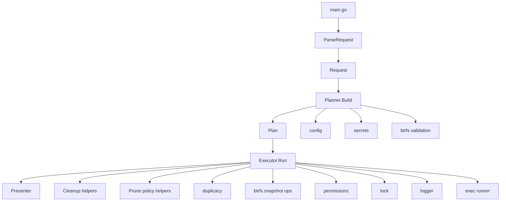

# How It Works

This document is the detailed internal guide for `synology-duplicacy-backup`.

It is meant to answer questions like:

- What actually happens when the binary starts?
- Which package owns which decisions?
- Where does config become runtime behavior?
- Where do operator-facing messages come from?
- If I need to change backup, prune, storage cleanup, or fix-perms behavior, where do I look?

If you want the short version, start with [architecture.md](architecture.md).
This document is the longer walkthrough.

## Mental Model

The application now follows an explicit:

```text
Request -> Plan -> Execute
```

That is the core architectural idea.

- `Request` means: what the user asked for on the CLI.
- `Plan` means: the fully validated, resolved execution contract.
- `Execute` means: the side-effecting runtime path that actually does the work.

The main benefit of this split is that the code no longer mixes:

- argument parsing
- environment validation
- config/secrets loading
- summary rendering
- command execution
- cleanup

inside one large coordinator.

## Top-Level Runtime Flow

At runtime, the application enters through:

- [`cmd/duplicacy-backup/main.go`](/Users/phillipmcmahon/codex/synology-duplicacy-backup/cmd/duplicacy-backup/main.go)

The high-level path is:

```text
main
  -> run
    -> runWithArgs
      -> workflow.ParseRequest
      -> initLogger
      -> workflow.NewPlanner(...).Build(...)
      -> workflow.NewExecutor(...).Run()
```

In other words:

1. Parse CLI intent.
2. Initialise logging.
3. Build a validated execution plan.
4. Execute the plan.

## Architecture Overview



## Main Packages

### Entry point

- [`cmd/duplicacy-backup/main.go`](/Users/phillipmcmahon/codex/synology-duplicacy-backup/cmd/duplicacy-backup/main.go)

This file should stay thin.

It owns:

- application version/build metadata
- runtime/bootstrap wiring
- logger initialization
- transition from CLI arguments into workflow

It should not own business logic for backup, prune, storage cleanup, or
fix-perms behavior.

### Workflow package

- [`internal/workflow`](/Users/phillipmcmahon/codex/synology-duplicacy-backup/internal/workflow)

This is the orchestration layer.

It owns:

- request parsing
- runtime/environment seams
- plan building
- runtime execution
- operator-facing message translation
- summary and presentation logic

This package is now the heart of the application.

### Domain packages

These packages do focused work and should stay relatively narrow:

- [`internal/config`](/Users/phillipmcmahon/codex/synology-duplicacy-backup/internal/config)
  Parses and validates config files.
- [`internal/secrets`](/Users/phillipmcmahon/codex/synology-duplicacy-backup/internal/secrets)
  Loads and validates remote secrets files.
- [`internal/btrfs`](/Users/phillipmcmahon/codex/synology-duplicacy-backup/internal/btrfs)
  Validates btrfs locations and manages snapshots.
- [`internal/duplicacy`](/Users/phillipmcmahon/codex/synology-duplicacy-backup/internal/duplicacy)
  Prepares and runs Duplicacy commands.
- [`internal/permissions`](/Users/phillipmcmahon/codex/synology-duplicacy-backup/internal/permissions)
  Applies local ownership and permission normalization.
- [`internal/lock`](/Users/phillipmcmahon/codex/synology-duplicacy-backup/internal/lock)
  Directory-based PID locking.
- [`internal/logger`](/Users/phillipmcmahon/codex/synology-duplicacy-backup/internal/logger)
  Structured log formatting and log cleanup.
- [`internal/exec`](/Users/phillipmcmahon/codex/synology-duplicacy-backup/internal/exec)
  Shared command execution abstraction and test mocks.
- [`internal/errors`](/Users/phillipmcmahon/codex/synology-duplicacy-backup/internal/errors)
  Typed internal error contracts.

## Request Phase

The request phase lives in:

- [`internal/workflow/request.go`](/Users/phillipmcmahon/codex/synology-duplicacy-backup/internal/workflow/request.go)
- [`internal/workflow/runtime.go`](/Users/phillipmcmahon/codex/synology-duplicacy-backup/internal/workflow/runtime.go)

The job of the request phase is to answer:

> What did the operator ask for?

It does not answer:

> Is that possible on this machine?
> Where are the files?
> What are the exact commands?

### What `Request` contains

The `Request` type contains user intent only:

- requested operations such as backup, prune, and storage cleanup
- `--fix-perms`
- `--force-prune` as a prune-threshold override
- `--remote`
- `--dry-run`
- config/secrets directory overrides
- source label

It also derives convenience booleans such as:

- `DoBackup`
- `DoPrune`
- `DoCleanupStore`
- `FixPermsOnly`

Those operation flags can be combined. The CLI order does not matter; runtime
execution order is fixed as:

1. backup
2. prune
3. cleanup-storage
4. fix-perms

`--cleanup-storage` requests `duplicacy prune -exhaustive -exclusive` as a
standalone maintenance step. `--force-prune` only affects prune threshold
enforcement, so these are all valid and distinct intents:

- safe prune
- storage cleanup
- forced prune
- safe prune + storage cleanup
- forced prune + storage cleanup

Those are still request-level concepts because they describe intent, not machine state.

### What happens in `ParseRequest`

`ParseRequest` performs:

1. `--help` and `--version` early handling
2. raw flag parsing
3. default-mode derivation
4. request validation
5. source-label validation

### Why this matters

The request phase is intentionally cheap and non-invasive.

It does not:

- initialize work directories
- read config files
- check for root
- check for `duplicacy`
- acquire a lock

That keeps the CLI boundary predictable and easy to test.

## Runtime and Metadata Seams

The runtime abstraction lives in:

- [`internal/workflow/runtime.go`](/Users/phillipmcmahon/codex/synology-duplicacy-backup/internal/workflow/runtime.go)

It provides injectable functions for:

- effective user id
- `PATH` lookups
- lock construction
- time
- temp dir
- PID
- environment variables
- executable discovery
- symlink evaluation
- signal registration

This is the main seam that makes entrypoint and workflow tests practical without
mocking whole packages.

`Metadata` holds stable application-level constants like:

- script name
- version
- build time
- root volume
- lock directory parent
- log directory

## Plan Phase

The plan phase lives mainly in:

- [`internal/workflow/planner.go`](/Users/phillipmcmahon/codex/synology-duplicacy-backup/internal/workflow/planner.go)
- [`internal/workflow/plan.go`](/Users/phillipmcmahon/codex/synology-duplicacy-backup/internal/workflow/plan.go)
- [`internal/workflow/summary.go`](/Users/phillipmcmahon/codex/synology-duplicacy-backup/internal/workflow/summary.go)

The job of the planner is to answer:

> Given this request and this machine, what exactly should execution do?

### Planning rules

Planning is allowed to:

- inspect the environment
- validate prerequisites
- read config
- read secrets
- derive paths
- derive operation mode text
- derive summary lines
- derive execution-ready command strings

Planning is not allowed to:

- create directories
- acquire locks
- create snapshots
- run Duplicacy operations
- change permissions
- delete anything

That is an important design rule.

### What `Planner.Build` does

`Build` performs these steps:

1. `validateEnvironment(req)`
2. `derivePlan(req)`
3. `loadConfig(plan)`
4. `loadSecrets(plan)` when remote mode is active
5. `populateCommands(plan)`
6. `SummaryLines(plan)`

### `validateEnvironment`

This checks:

- root execution
- `duplicacy` availability when backup/prune work is requested
- `btrfs` availability when backup work is requested

### `derivePlan`

This creates the first concrete runtime shape:

- backup label
- timestamp
- temp work root
- snapshot source and target
- repository path
- config path
- secrets path
- mode display
- whether Duplicacy setup and snapshots are needed

This is where abstract user intent becomes machine-specific paths.

### `loadConfig`

This is where config becomes behavior.

It:

- checks the config file exists
- parses `[common]` plus `[local]` or `[remote]`
- applies values into `config.Config`
- validates required keys
- validates thresholds
- validates owner/group if `--fix-perms` is active
- builds prune args
- validates backup thread rules
- validates btrfs placement for backup mode

After this step, the plan is populated with things the executor can use directly:

- `Threads`
- `Filter`
- `FilterLines`
- `OwnerGroup`
- `PruneArgs`
- `LogRetentionDays`
- safe-prune thresholds
- operation mode string

### `loadSecrets`

This only runs in remote mode.

It:

- resolves the exact secrets path
- loads the file
- validates ownership/permissions
- validates required secret values

The resulting `Secrets` object is attached to the plan.

### `populateCommands`

This step is one of the most important recent improvements.

The plan now carries many execution-ready command descriptions, such as:

- snapshot create/delete
- work-dir creation/removal
- preferences write
- filter write
- work-dir permission fixes
- backup command
- repo validation
- prune preview
- policy prune
- storage cleanup
- fix-perms commands

These strings are used for:

- dry-run output
- tests
- keeping executor logic focused on sequencing instead of reconstructing command descriptions

### What the `Plan` now represents

The `Plan` is no longer just “resolved config plus some flags.”

It is the execution contract.

It contains:

- mode decisions
- resolved paths
- loaded secrets
- summary-ready values
- ownership and prune thresholds
- execution-ready command descriptions
- cleanup-relevant paths

The more complete the plan is, the less the executor has to know about request parsing or config internals.

## Execute Phase

The execution phase lives mainly in:

- [`internal/workflow/executor.go`](/Users/phillipmcmahon/codex/synology-duplicacy-backup/internal/workflow/executor.go)
- [`internal/workflow/cleanup.go`](/Users/phillipmcmahon/codex/synology-duplicacy-backup/internal/workflow/cleanup.go)
- [`internal/workflow/prune.go`](/Users/phillipmcmahon/codex/synology-duplicacy-backup/internal/workflow/prune.go)
- [`internal/workflow/permissions_exec.go`](/Users/phillipmcmahon/codex/synology-duplicacy-backup/internal/workflow/permissions_exec.go)

The job of the executor is to answer:

> Given this plan, in what order do we perform the side effects?

### What `Executor` owns

`Executor` owns:

- signal handling
- log retention cleanup
- lock acquisition
- header/summary printing
- Duplicacy setup
- backup execution
- prune execution
- fix-perms execution
- final cleanup
- exit code

It should not need to recalculate planning decisions.

### `Executor.Run`

The rough path is:

1. install signal handler
2. defer cleanup
3. log any default-mode notice
4. clean old logs
5. acquire lock
6. print header
7. print summary
8. execute operational phases
9. print success and exit `0`

If any step fails:

- the error is translated by workflow-owned messaging
- `exitCode` is set to `1`
- deferred cleanup still runs

## Presentation Layer

Presentation is handled by:

- [`internal/workflow/presenter.go`](/Users/phillipmcmahon/codex/synology-duplicacy-backup/internal/workflow/presenter.go)

This file exists so `Executor` does not have to mix sequencing with formatting.

The presenter owns:

- startup header
- configuration summary
- command stdout/stderr streaming
- prune preview summary lines
- final completion block

This is intentionally small, but it helps keep runtime flow readable.

## Error Translation

Operator-facing message translation is handled by:

- [`internal/workflow/messages.go`](/Users/phillipmcmahon/codex/synology-duplicacy-backup/internal/workflow/messages.go)

This is an important boundary.

The design rule is:

- domain packages return typed/internal errors
- workflow owns final operator-facing wording

That keeps message tone and punctuation consistent.

### Main error families

The translator understands:

- `RequestError`
- `MessageError`
- `ConfigError`
- `SecretsError`
- `LockError`
- `BackupError`
- `PruneError`
- `SnapshotError`
- `PermissionsError`

If an error is not explicitly translated, the workflow falls back to a normalized sentence version of `err.Error()`.

### Why this is useful

Without this layer, user-facing wording gets scattered across:

- config parsing
- secrets loading
- locking
- backup/prune execution
- cleanup

With this layer, output consistency has one main owner.

## Backup Flow

When backup mode is active, the runtime path is roughly:

1. planner validates environment and config
2. executor acquires lock
3. executor creates a read-only btrfs snapshot
4. executor creates the Duplicacy work directory
5. executor writes preferences
6. executor writes filters when configured
7. executor fixes work-dir permissions
8. executor runs `duplicacy backup`
9. cleanup deletes the snapshot and work directory
10. lock is released

The actual snapshot and Duplicacy work is delegated to:

- [`internal/btrfs`](/Users/phillipmcmahon/codex/synology-duplicacy-backup/internal/btrfs)
- [`internal/duplicacy`](/Users/phillipmcmahon/codex/synology-duplicacy-backup/internal/duplicacy)

## Prune Flow

When prune mode is active, the runtime path is roughly:

1. planner validates environment and config
2. executor acquires lock
3. executor prepares Duplicacy setup
4. executor validates repository access
5. executor runs safe-prune preview
6. executor enforces count/percentage thresholds
7. executor runs policy prune
8. executor optionally runs storage cleanup
9. cleanup removes work directory
10. lock is released

The interesting part here is that prune policy is enforced in workflow code, not buried inside the Duplicacy package.

That means:

- Duplicacy package gathers preview data
- workflow decides whether to continue

This is a good boundary because threshold enforcement is application policy, not a raw command concern.

## Fix-Perms Flow

When `--fix-perms` is active, the runtime path depends on mode:

- backup + fix-perms
- prune + fix-perms
- fix-perms only

The actual permission application is delegated to:

- [`internal/permissions`](/Users/phillipmcmahon/codex/synology-duplicacy-backup/internal/permissions)

The workflow layer decides:

- when to run it
- which target path to use
- what summary and dry-run output to show

## Cleanup Lifecycle

Cleanup is handled in:

- [`internal/workflow/cleanup.go`](/Users/phillipmcmahon/codex/synology-duplicacy-backup/internal/workflow/cleanup.go)

It is deliberately idempotent.

That matters because cleanup can run from:

- normal deferred exit
- error exit
- signal path

Cleanup currently handles:

- snapshot deletion
- snapshot directory removal
- Duplicacy work directory removal
- lock release
- final completion output

The executor tracks whether cleanup already ran so it can safely be called more than once.

## Logging and Output

Logging is handled by:

- [`internal/logger`](/Users/phillipmcmahon/codex/synology-duplicacy-backup/internal/logger)

Workflow output uses the logger for:

- headers
- summary lines
- dry-run command lines
- streamed subprocess output
- warnings/errors
- final result blocks

Current message rules are:

- workflow owns final operator wording
- operator-facing messages should be concise and consistent
- status lines should not force terminal punctuation
- domain packages should avoid owning final tone/style

## Testing Strategy

The refactor changed the testing model too.

The main test layers are now:

### Request tests

These verify:

- flag parsing
- default mode behavior
- label validation
- help/version handling
- invalid combinations

### Planner tests

These verify:

- config and secrets loading
- path derivation
- command-string population
- summary-ready values
- plan shape

### Executor tests

These verify:

- lifecycle ordering
- prune enforcement
- cleanup behavior
- dry-run behavior
- phase dispatch

### Entrypoint tests

These verify the real `runWithArgs` path end to end for representative cases.

See:

- [`TESTING.md`](/Users/phillipmcmahon/codex/synology-duplicacy-backup/TESTING.md)

## Where To Change Things

If you want to change a specific behavior, start here:

### CLI behavior

- [`internal/workflow/request.go`](/Users/phillipmcmahon/codex/synology-duplicacy-backup/internal/workflow/request.go)
- [`internal/workflow/runtime.go`](/Users/phillipmcmahon/codex/synology-duplicacy-backup/internal/workflow/runtime.go)

### Path derivation and execution contract

- [`internal/workflow/planner.go`](/Users/phillipmcmahon/codex/synology-duplicacy-backup/internal/workflow/planner.go)
- [`internal/workflow/plan.go`](/Users/phillipmcmahon/codex/synology-duplicacy-backup/internal/workflow/plan.go)

### Summary rendering

- [`internal/workflow/summary.go`](/Users/phillipmcmahon/codex/synology-duplicacy-backup/internal/workflow/summary.go)
- [`internal/workflow/presenter.go`](/Users/phillipmcmahon/codex/synology-duplicacy-backup/internal/workflow/presenter.go)

### Operator-facing error text

- [`internal/workflow/messages.go`](/Users/phillipmcmahon/codex/synology-duplicacy-backup/internal/workflow/messages.go)

### Backup and prune sequencing

- [`internal/workflow/executor.go`](/Users/phillipmcmahon/codex/synology-duplicacy-backup/internal/workflow/executor.go)
- [`internal/workflow/prune.go`](/Users/phillipmcmahon/codex/synology-duplicacy-backup/internal/workflow/prune.go)

### Cleanup behavior

- [`internal/workflow/cleanup.go`](/Users/phillipmcmahon/codex/synology-duplicacy-backup/internal/workflow/cleanup.go)

### Duplicacy CLI setup and commands

- [`internal/duplicacy`](/Users/phillipmcmahon/codex/synology-duplicacy-backup/internal/duplicacy)

### Config and secrets behavior

- [`internal/config`](/Users/phillipmcmahon/codex/synology-duplicacy-backup/internal/config)
- [`internal/secrets`](/Users/phillipmcmahon/codex/synology-duplicacy-backup/internal/secrets)

## Practical Reading Order

If you have been away from the codebase and need to re-orient quickly, this is the reading order I would recommend:

1. [`cmd/duplicacy-backup/main.go`](/Users/phillipmcmahon/codex/synology-duplicacy-backup/cmd/duplicacy-backup/main.go)
2. [`internal/workflow/request.go`](/Users/phillipmcmahon/codex/synology-duplicacy-backup/internal/workflow/request.go)
3. [`internal/workflow/planner.go`](/Users/phillipmcmahon/codex/synology-duplicacy-backup/internal/workflow/planner.go)
4. [`internal/workflow/plan.go`](/Users/phillipmcmahon/codex/synology-duplicacy-backup/internal/workflow/plan.go)
5. [`internal/workflow/executor.go`](/Users/phillipmcmahon/codex/synology-duplicacy-backup/internal/workflow/executor.go)
6. [`internal/workflow/prune.go`](/Users/phillipmcmahon/codex/synology-duplicacy-backup/internal/workflow/prune.go)
7. [`internal/workflow/cleanup.go`](/Users/phillipmcmahon/codex/synology-duplicacy-backup/internal/workflow/cleanup.go)
8. [`internal/workflow/messages.go`](/Users/phillipmcmahon/codex/synology-duplicacy-backup/internal/workflow/messages.go)

That path usually gives the clearest mental model with the least jumping around.

## Short Summary

If you want the shortest possible internal description:

- `Request` captures CLI intent.
- `Planner` turns intent into a validated execution contract.
- `Executor` performs the side effects in order.
- `Presenter` owns runtime rendering.
- `messages.go` owns final operator-facing wording.
- domain packages do focused work and return data or typed errors.

That is now the core shape of the application.
