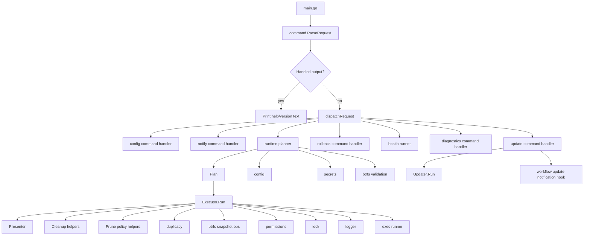

# How It Works

This document is the detailed internal guide for `synology-duplicacy-backup`.

It answers questions like:

- What actually happens when the binary starts?
- Which package owns which decisions?
- Where does config become runtime behaviour?
- Where do operator-facing messages come from?
- If I need to change backup, prune, or storage cleanup behaviour, where do I look?

If you want the short version, start with [architecture.md](architecture.md).
This is the longer walkthrough.

## Contents

- [Mental Model](#mental-model)
- [Top-Level Runtime Flow](#top-level-runtime-flow)
- [Architecture Overview](#architecture-overview)
- [Main Packages](#main-packages)
- [Request Phase](#request-phase)
- [Runtime and Metadata Seams](#runtime-and-metadata-seams)
- [Label-Target Model](#label-target-model)
- [Plan Phase](#plan-phase)
- [Execute Phase](#execute-phase)
- [Presentation Layer](#presentation-layer)
- [Error Translation](#error-translation)
- [Backup Flow](#backup-flow)
- [Prune Flow](#prune-flow)
- [Cleanup Lifecycle](#cleanup-lifecycle)
- [Logging and Output](#logging-and-output)
- [Testing Strategy](#testing-strategy)
- [Where To Change Things](#where-to-change-things)
- [Practical Reading Order](#practical-reading-order)
- [Short Summary](#short-summary)

## Mental Model

The application now follows an explicit command-specific request model:

```text
parsed Request -> command-specific request -> handler
```

Only runtime operations continue into the full execution path:

```text
RuntimeRequest -> Plan -> Execute
```

That is the core architectural idea.

- `Request` means: the parser envelope describing raw CLI intent.
- command-specific request types mean: the narrow input each handler actually
  needs.
- `Plan` means: the fully validated, resolved runtime execution contract.
- `Execute` means: the side-effecting runtime path that actually does the work.

The main benefit of this split is that the code no longer mixes:

- argument parsing
- environment validation
- config/secrets loading
- summary rendering
- command execution
- cleanup

inside one large coordinator.

## Top-Level Runtime Flow

At runtime, the application enters through:

- [`cmd/duplicacy-backup/main.go`](../cmd/duplicacy-backup/main.go)

The high-level path is:

```text
main
  -> run
    -> runWithArgs
      -> command.ParseRequest
      -> handled help/version output, or dispatchRequest
           -> config / diagnostics / notify / rollback / update / health / runtime
```

In other words:

1. Parse CLI intent.
2. Print handled help/version output immediately, or project the parsed request
   into the matching command-specific request type.
3. Initialise logging, build a plan, and execute only when the selected runtime
   path actually needs those steps.

Supporting packages now keep adjacent concerns together:
- `internal/command` owns CLI request parsing and help text
- `internal/health` owns health reporting, health JSON output, and health presentation
- `internal/notify` owns notification delivery and notify-test reporting
- `internal/update` owns self-update planning, download, checksum and
  attestation verification, install execution, and managed rollback activation
- `internal/presentation` owns shared output formatting and the runtime presenter

## Architecture Overview



## Main Packages

### Entry point

- [`cmd/duplicacy-backup/main.go`](../cmd/duplicacy-backup/main.go)

This file should stay thin.

It owns:

- application version/build metadata
- runtime/bootstrap wiring
- logger initialisation for health and runtime execution paths
- transition from CLI arguments into workflow

It should not own business logic for backup, prune, or storage cleanup
behaviour.

### Command package

- [`internal/command`](../internal/command)

This is the command-surface layer.

It owns:

- request parsing
- CLI help and usage text
- request-level validation

### Workflow package

- [`internal/workflow`](../internal/workflow)

This is the orchestration layer.

It owns:

- runtime/environment seams
- plan building
- runtime execution
- operator-facing message translation
- workflow-specific execution sequencing and policy

This package is now the heart of the application.

### Health package

- [`internal/health`](../internal/health)

This package owns health-specific report modelling and presentation.

It owns:

- health JSON report shaping
- health report status/failure semantics
- verify result reconciliation for failed or missing revision integrity results
- health-specific terminal presentation helpers

### Notify package

- [`internal/notify`](../internal/notify)

This package owns provider delivery and notify-test reports.

It owns:

- generic notification payload modelling
- webhook and native `ntfy` delivery
- notify-test terminal and JSON report shaping

### Update package

- [`internal/update`](../internal/update)

This package owns the managed update and rollback command paths.

It owns:

- [`internal/update/update.go`](../internal/update/update.go): updater construction, command handoff, high-level run flow, and update plan assembly
- [`internal/update/release.go`](../internal/update/release.go): GitHub release lookup and platform asset naming
- [`internal/update/attestation.go`](../internal/update/attestation.go): optional GitHub release-asset attestation verification
- [`internal/update/package.go`](../internal/update/package.go): package download, checksum verification, archive extraction, and binary discovery
- [`internal/update/install.go`](../internal/update/install.go): managed install layout detection, operator confirmation, and packaged installer execution
- [`internal/update/rollback.go`](../internal/update/rollback.go): retained-version discovery, rollback confirmation, and managed symlink activation
- [`internal/update/report.go`](../internal/update/report.go): operator-facing update report rendering

### Presentation package

- [`internal/presentation`](../internal/presentation)

This package owns shared runtime/config presentation helpers.

It owns:

- runtime presenter behaviour used by backup/prune/cleanup execution
- config/report line formatting helpers
- shared output-shaping logic that should not live in orchestration code

### Domain packages

These packages do focused work and should stay relatively narrow:

- [`internal/config`](../internal/config)
  Parses and validates config files.
- [`internal/secrets`](../internal/secrets)
  Loads and validates label secrets files.
- [`internal/btrfs`](../internal/btrfs)
  Validates btrfs locations and manages snapshots.
- [`internal/duplicacy`](../internal/duplicacy)
  Prepares and runs Duplicacy commands.
- [`internal/lock`](../internal/lock)
  Directory-based PID locking.
- [`internal/logger`](../internal/logger)
  Structured log formatting and log cleanup.
- [`internal/exec`](../internal/exec)
  Shared command execution abstraction and test mocks.
- [`internal/errors`](../internal/errors)
  Typed internal error contracts.

## Request Phase

The request phase lives in:

- [`internal/command/request.go`](../internal/command/request.go)
- [`internal/command/usage.go`](../internal/command/usage.go)
- [`internal/workflow/request.go`](../internal/workflow/request.go)

The job of the request phase is to answer:

> What did the operator ask for?

It does not answer:

> Is that possible on this machine?
> Where are the files?
> What are the exact commands?

### What `Request` contains

The parser `Request` contains raw CLI intent only:

- selected runtime command such as `backup`, `prune`, or `cleanup-storage`
- `--force` as a prune-threshold override for `prune`
- `--target <name>` as the explicit destination selector
- `--dry-run`
- config/secrets directory overrides
- source label
- command selectors for `config`, `diagnostics`, `notify`, `restore`,
  `rollback`, `update`, and `health`

Runtime operations are first-class CLI commands rather than combinable
operation flags. Workflow projects the parser request into a `RuntimeRequest`
with one `RuntimeMode`, so backup, prune, and cleanup-storage remain mutually
exclusive inside the runtime planner:

`cleanup-storage` requests `duplicacy prune -exhaustive -exclusive` as a
standalone maintenance step. `prune --force` only affects prune threshold
enforcement, so these are valid and distinct intents:

- safe prune
- storage cleanup
- forced prune

`prune --dry-run` is repository-derived: it runs the safe-prune preview and
reads snapshot/revision metadata. For local filesystem repositories that means
the same sudo boundary as real prune. `cleanup-storage --dry-run` is different:
it is simulation-only and prints the commands without scanning chunks.

Those are still request-level concepts because they describe intent, not machine state.

### What happens in `ParseRequest`

`ParseRequest` performs:

1. `--help` and `--version` early handling
2. raw flag parsing
3. explicit operation validation
4. request validation
5. source-label validation

### How parse output is dispatched

`ParseRequest` returns either handled output or a populated `Request`.

Handled output is terminal and side-effect free. `runWithArgs` prints it and
returns without creating a logger, reading config, checking privileges, or
touching backup state.

Unresolved requests go through `dispatchRequest` in
[`cmd/duplicacy-backup/dispatch.go`](../cmd/duplicacy-backup/dispatch.go):

- `ConfigCommand` routes to `workflow.HandleConfigCommand`
- `DiagnosticsCommand` routes to `workflow.HandleDiagnosticsCommand`
- `NotifyCommand` routes to `workflow.HandleNotifyCommand`
- `RestoreCommand` routes to `workflow.HandleRestoreCommand`
- `RollbackCommand` routes to the managed rollback adapter in the update
  package
- `UpdateCommand` routes to the update adapter and the update notification hooks
- `HealthCommand` routes to `workflow.NewHealthRunner(...).Run(...)`
- everything else is treated as a runtime backup/prune/cleanup
  request, projected to `RuntimeRequest`, and then passed through
  `Planner.Build` followed by `Executor.Run`

This dispatch point is why global commands such as `update`, `rollback`, and
`notify test update` do not inherit label-target runtime requirements. It also
keeps diagnostics and restore drill commands out of the runtime executor path:
`diagnostics` is non-mutating, `restore plan` and `restore list-revisions` are
read-only, `restore select` is an interactive revision-first guide that can
inspect or delegate a restore only after explicit confirmation, and
`restore run` prepares or reuses a drill workspace before executing Duplicacy
with `-ignore-owner` only inside that workspace. Restore execution prints
operator progress to stderr while keeping the final report on stdout.

Local filesystem restore repositories are root-protected OS resources, so
`restore list-revisions`, `restore select`, and `restore run` require `sudo`
for those targets. Object restore remains governed by the operator profile and
storage credentials; remote mounted filesystem restore remains governed by the
operator profile and mount permissions.

`diagnostics` is the support-bundle path. It resolves one label and target,
redacts secret values, reports config/storage/state/path context, and exits
without running Duplicacy backup, prune, restore, or cleanup operations.

`rollback` is the managed-install recovery path. It inspects retained
versioned binaries under the managed install root, chooses either the newest
previous retained version or an explicit `--version`, and activates it by
changing the managed `current` symlink. It does not download releases and does
not modify runtime config or secrets.

### Why this matters

The request phase is intentionally cheap and non-invasive.

It does not:

- initialise work directories
- read config files
- check for root
- check for `duplicacy`
- acquire a lock

That keeps the CLI boundary predictable and easy to test.

## Runtime and Metadata Seams

The runtime abstraction lives in:

- [`internal/workflow/runtime.go`](../internal/workflow/runtime.go)

It provides injectable functions for:

- effective user id
- `PATH` lookups
- lock construction
- source-lock construction
- time
- temp dir
- PID
- environment variables
- executable discovery
- symlink evaluation
- signal registration

This is the main seam that makes entrypoint and workflow tests practical without
mocking whole packages.

`Metadata` holds stable application-level constants like:

- script name
- version
- build time
- root volume
- lock directory parent
- log directory

## Label-Target Model

The operational identity is now:

```text
label + target
```

Examples:

- `homes/onsite-usb`
- `homes/offsite-storj`

That identity flows through:

- config selection: `<label>-backup.toml`
- secrets selection: `<label>-secrets.toml` plus `[targets.<name>]`
- state files: `<label>.<target>.json`
- machine JSON summaries: `label` plus `target`
- repository-phase locking: one lock per label-target pair

Runtime and health recency updates both use the same state mutation helper:
load the existing `<label>.<target>.json` file when present, apply one focused
mutation, then save the normalised state file back with the standard
permissions.

This lets one source label keep multiple independent destinations without
forcing revision parity or schedule alignment between them.

Each target also resolves into a small operational model:

```text
storage + location
```

- `storage` is passed directly to Duplicacy
- `location` is the operational placement: `local` or `remote`

Supported locations are intentionally limited to:

- local
- remote

This keeps every storage backend behind Duplicacy while still giving operators
useful scheduling and reporting language. Local disk paths, mounted remote
filesystem paths, native Duplicacy backends, and S3-compatible services all use
one target shape. A mounted remote filesystem can use a path-based storage value
with `location = "remote"`; a local RustFS or MinIO service can use URL-like
storage with `location = "local"`.

## Plan Phase

The plan phase lives mainly in:

- [`internal/workflow/planner.go`](../internal/workflow/planner.go)
- [`internal/workflow/plan.go`](../internal/workflow/plan.go)
- [`internal/workflow/summary.go`](../internal/workflow/summary.go)

The job of the planner is to answer:

> Given this request and this machine, what exactly should execution do?

### Planning rules

Planning is allowed to:

- inspect the environment
- validate prerequisites
- read config
- read secrets
- derive paths
- derive operation mode text
- derive summary lines
- derive execution-ready command strings

Planning is not allowed to:

- create directories
- acquire locks
- create snapshots
- run Duplicacy operations
- change permissions
- delete anything

That is an important design rule.

### What `Planner.Build` does

`Build` performs these steps:

1. `validateEnvironment(req)`
2. `deriveRuntimePlan(req)`
3. `loadConfig(plan)`
4. `plan.applyConfig(cfg, runtime)`
5. `loadSecrets(plan)` when the selected storage value needs secrets
6. `populateCommands(plan)`
7. `SummaryLines(plan)`

### `validateEnvironment`

This checks:

- root execution
- `duplicacy` availability when backup/prune work is requested
- `btrfs` availability when backup work is requested

### `deriveRuntimePlan`

This creates the first concrete runtime shape:

- backup label
- timestamp
- temp work root
- snapshot source and target
- repository path
- config path
- secrets path
- mode display
- whether Duplicacy setup and snapshots are needed

This is where abstract user intent becomes machine-specific paths.

### `loadConfig`

This is where config becomes behaviour.

It:

- checks the config file exists
- parses the label config structure
  - top-level `label`
  - top-level `source_path`
  - optional `[common]`
  - optional `[health]`
  - optional `[health.notify]`
    - generic webhook JSON for health outcomes and opt-in runtime failures
    - optional native `[health.notify.ntfy]` destination
  - one or more `[targets.<name>]`
  - optional `[targets.<name>.health]`
  - optional `[targets.<name>.health.notify]`
- applies values into `config.Config`
- validates required keys
- validates thresholds
- validates the target model:
  - storage value
  - deployment location
Self-update notifications intentionally do not flow through `loadConfig`,
because update is application maintenance rather than a label/target
operation. The update path reads global app config from
`<config-dir>/duplicacy-backup.toml` when `[update.notify]` is present.
- builds prune args
- validates backup thread rules
- validates btrfs placement for backup mode

After this step, the plan is populated with things the executor can use directly:

- `Threads`
- `Filter`
- `FilterLines`
- `PruneArgs`
- `LogRetentionDays`
- safe-prune thresholds
- operation mode string
- storage value
- location

Operationally, `source_path` is expected to be the real Btrfs volume or
subvolume root for the label when the NAS is going to run backups. Fine-grained
inclusion and exclusion under that root is handled by Duplicacy filters, not by
pointing `source_path` at an arbitrary nested child directory.

Restore-only disaster recovery access is deliberately looser. Restore commands
can read an existing repository without `source_path`, because the original
source tree may not exist on a replacement NAS yet. In that mode, copy-back
context is unavailable. The default drill workspace is derived from the restore
job itself:
`/volume1/restore-drills/<label>-<target>-<restore-point-timestamp>-rev<id>`.
If the operator supplies `--workspace-root`, that existing root remains
operator-managed and the tool creates the derived job folder underneath it.

### `loadSecrets`

This runs only when the selected storage value needs secrets.

It:

- resolves the exact secrets path
- loads the file
- validates ownership/permissions
- validates generic storage key values

The resulting `Secrets` object is attached to the plan.

Path-based Duplicacy storage targets do not call `loadSecrets` for storage
credentials, even when their `location` is `remote`. URL-like storage values
only call `loadSecrets` when that backend requires runtime keys. That is a
deliberate consequence of the model: the Duplicacy storage value drives
credential requirements, not deployment location.

### `populateCommands`

This step is one of the most important recent improvements.

The plan now carries many execution-ready command descriptions, such as:

- snapshot create/delete
- work-dir creation/removal
- preferences write
- filter write
- work-dir permission fixes
- backup command
- repo validation
- prune preview
- policy prune
- storage cleanup
These strings are used for:

- dry-run output
- tests
- keeping executor logic focused on sequencing instead of reconstructing command descriptions

### What the `Plan` now represents

The `Plan` is no longer just “resolved config plus some flags.”

It is the execution contract.

It stores those concerns in explicit named sections so future changes can be
discussed in the right shape:

- `PlanRequest` for mode decisions and resolved operator intent
- `PlanConfig` for label, target, health notify, ownership, prune, and threshold values
- `PlanPaths` for resolved filesystem, config, secrets, snapshot, and storage paths
- `PlanDisplay` for operator-facing command descriptions

Together, those sections contain:

- loaded secrets
- summary-ready values
- cleanup-relevant paths

The more complete the plan is, the less the executor has to know about request parsing or config internals.

## Execute Phase

The execution phase lives mainly in:

- [`internal/workflow/executor.go`](../internal/workflow/executor.go)
- [`internal/workflow/cleanup.go`](../internal/workflow/cleanup.go)
- [`internal/workflow/prune.go`](../internal/workflow/prune.go)

The job of the executor is to answer:

> Given this plan, in what order do we perform the side effects?

### What `Executor` owns

`Executor` owns:

- signal handling
- log retention cleanup
- lock acquisition
- header/summary printing
- Duplicacy setup
- backup execution
- prune execution
- storage cleanup execution
- final cleanup
- exit code

It should not need to recalculate planning decisions.

### `Executor.Run`

The rough path is:

1. install signal handler
2. defer cleanup
3. log any default-mode notice
4. clean old logs
5. acquire lock
6. print header
7. print summary
8. execute operational phases
9. print success and exit `0`

If any step fails:

- the error is translated by workflow-owned messaging
- `exitCode` is set to `1`
- deferred cleanup still runs

## Presentation Layer

Presentation is handled by:

- [`internal/presentation/runtime.go`](../internal/presentation/runtime.go)

This package exists so `Executor` does not have to mix sequencing with formatting.

The presenter owns:

- startup header
- configuration summary
- command stdout/stderr streaming
- prune preview summary lines
- final completion block

This is intentionally small, but it helps keep runtime flow readable.

All command surfaces should use the shared operator-facing vocabulary in
`internal/presentation` for repeated labels and status values. Internal report
keys can remain domain-specific for JSON and tests, but display output should
prefer common labels such as `Config File`, `Source Path`, `Repository Access`,
and `Integrity Check` whenever commands describe the same operational concept.

The CLI has two intentional output modes. Report-style commands such as
`config`, `diagnostics`, `restore plan`, and `restore list-revisions` print
compact plain reports for inspection and copy/paste review. Long-running or
state-changing commands such as `backup`, `prune`, `cleanup-storage`, and
`health` print timestamped framed logs so progress, alerts, and final status
remain visible in terminals, DSM scheduled-task logs, and captured smoke output.
Both modes must use the same labels, status values, and remediation language.

## Error Translation

Operator-facing message translation is handled by:

- [`internal/workflow/messages.go`](../internal/workflow/messages.go)

This is an important boundary.

The design rule is:

- domain packages return typed/internal errors
- workflow owns final operator-facing wording

That keeps message tone and punctuation consistent.

`config validate` also follows this rule. It performs a read-only readiness
probe for the selected repository and reports operator-facing outcomes such as
`Valid`, `Not initialized`, `Requires sudo`, and `Invalid (...)` without
initialising storage or mutating repository state. `Requires sudo` is used for
local filesystem repositories because their chunk and snapshot metadata is
intentionally protected by root-owned OS permissions.

For source paths, `config validate` proves path presence and Btrfs subvolume
shape with stat-style checks. It does not require the operator account to read
protected source contents; actual backup execution remains the root/sudo path
that creates the snapshot and reads the snapshot tree.

`health status`, `health doctor`, and `health verify` use the same local
repository privilege boundary for repository probes: local filesystem
repositories should be checked with `sudo`, while remote mounted filesystem
repositories remain governed by mount credentials and object repositories
remain governed by configured storage credentials.

### Main error families

The translator understands:

- `RequestError`
- `MessageError`
- `ConfigError`
- `SecretsError`
- `LockError`
- `BackupError`
- `PruneError`
- `SnapshotError`
- `PermissionsError`

If an error is not explicitly translated, the workflow falls back to a normalized sentence version of `err.Error()`.

### Why this is useful

Without this layer, user-facing wording gets scattered across:

- config parsing
- secrets loading
- locking
- backup/prune execution
- cleanup

With this layer, output consistency has one main owner.

## Backup Flow

When backup mode is active, the runtime path is roughly:

1. planner validates environment and config
2. executor acquires lock
3. executor creates a read-only btrfs snapshot
4. executor creates the Duplicacy work directory
5. executor writes preferences
6. executor writes filters when configured
7. executor fixes work-dir permissions
8. executor runs `duplicacy backup`
9. cleanup deletes the snapshot and work directory
10. lock is released

The actual snapshot and Duplicacy work is delegated to:

- [`internal/btrfs`](../internal/btrfs)
- [`internal/duplicacy`](../internal/duplicacy)

## Prune Flow

When prune mode is active, the runtime path is roughly:

1. planner validates environment and config
2. executor acquires lock
3. executor prepares Duplicacy setup
4. executor validates repository access
5. executor runs safe-prune preview
6. executor enforces count/percentage thresholds
7. executor runs policy prune
8. executor optionally runs storage cleanup
9. cleanup removes work directory
10. lock is released

The interesting part here is that prune policy is enforced in workflow code, not buried inside the Duplicacy package.

That means:

- Duplicacy package gathers preview data
- workflow decides whether to continue

This is a good boundary because threshold enforcement is application policy, not a raw command concern.

## Cleanup Lifecycle

Cleanup is handled in:

- [`internal/workflow/cleanup.go`](../internal/workflow/cleanup.go)

It is deliberately idempotent.

That matters because cleanup can run from:

- normal deferred exit
- error exit
- signal path

Cleanup currently handles:

- snapshot deletion
- snapshot directory removal
- Duplicacy work directory removal
- lock release
- final completion output

The executor tracks whether cleanup already ran so it can safely be called more than once.

## Logging and Output

Logging is handled by:

- [`internal/logger`](../internal/logger)

Workflow output uses the logger for:

- headers
- summary lines
- dry-run command lines
- streamed subprocess output
- warnings/errors
- final result blocks

Current message rules are:

- workflow owns final operator wording
- operator-facing messages should be concise and consistent
- status lines should not force terminal punctuation
- domain packages should avoid owning final tone/style

## Testing Strategy

The refactor changed the testing model too.

The main test layers are now:

### Request tests

These verify:

- flag parsing
- default mode behaviour
- label validation
- help/version handling
- invalid combinations

### Planner tests

These verify:

- config and secrets loading
- path derivation
- command-string population
- summary-ready values
- plan shape

### Executor tests

These verify:

- lifecycle ordering
- prune enforcement
- cleanup behaviour
- dry-run behaviour
- phase dispatch

### Entrypoint tests

These verify the real `runWithArgs` path end to end for representative cases.

See:

- [`TESTING.md`](../TESTING.md)

## Where To Change Things

If you want to change a specific behaviour, start here:

### CLI behaviour

- [`internal/command/request.go`](../internal/command/request.go)
- [`internal/command/usage.go`](../internal/command/usage.go)
- [`internal/workflow/request.go`](../internal/workflow/request.go)

`internal/command/request.go` keeps source-label commands on a shared parser
path. Command-specific flags are handled as small extras around common target,
config, secrets, dry-run, verbose, and JSON-summary flags.

### Path derivation and execution contract

- [`internal/workflow/planner.go`](../internal/workflow/planner.go)
- [`internal/workflow/plan.go`](../internal/workflow/plan.go)

### Summary rendering

- [`internal/workflow/summary.go`](../internal/workflow/summary.go)
- [`internal/presentation/runtime.go`](../internal/presentation/runtime.go)

### Health reports and health presentation

- [`internal/health/report.go`](../internal/health/report.go)
- [`internal/health/verify.go`](../internal/health/verify.go)
- [`internal/health/presenter.go`](../internal/health/presenter.go)

### Operator-facing error text

- [`internal/workflow/messages.go`](../internal/workflow/messages.go)

### Backup and prune sequencing

- [`internal/workflow/executor.go`](../internal/workflow/executor.go)
- [`internal/workflow/prune.go`](../internal/workflow/prune.go)

### Cleanup behaviour

- [`internal/workflow/cleanup.go`](../internal/workflow/cleanup.go)

### Duplicacy CLI setup and commands

- [`internal/duplicacy`](../internal/duplicacy)

### Config and secrets behaviour

- [`internal/config`](../internal/config)
- [`internal/secrets`](../internal/secrets)

## Practical Reading Order

If you have been away from the codebase and need to re-orient quickly, this is the reading order I would recommend:

1. [`cmd/duplicacy-backup/main.go`](../cmd/duplicacy-backup/main.go)
2. [`internal/command/request.go`](../internal/command/request.go)
3. [`internal/command/usage.go`](../internal/command/usage.go)
4. [`internal/workflow/request.go`](../internal/workflow/request.go)
5. [`internal/workflow/planner.go`](../internal/workflow/planner.go)
6. [`internal/workflow/plan.go`](../internal/workflow/plan.go)
7. [`internal/workflow/executor.go`](../internal/workflow/executor.go)
8. [`internal/presentation/runtime.go`](../internal/presentation/runtime.go)
9. [`internal/workflow/messages.go`](../internal/workflow/messages.go)

That path usually gives the clearest mental model with the least jumping around.

## Short Summary

If you want the shortest possible internal description:

- `Request` captures CLI intent.
- workflow projects that parser envelope into command-specific request types.
- `Planner` turns runtime intent into a validated execution contract.
- `Executor` performs the side effects in order.
- `Presenter` owns runtime rendering.
- `messages.go` owns final operator-facing wording.
- domain packages do focused work and return data or typed errors.

That is now the core shape of the application.
